# Building Code Retrieval for Claude Code from Scratch

The story begins with a bug hunt...

When I opened Claude Code and asked it to help me locate a bug, what happened? It repeatedly used grep + read file tools, guessing possible keywords and constantly searching through massive amounts of files. After a minute, it still hadn't found anything.
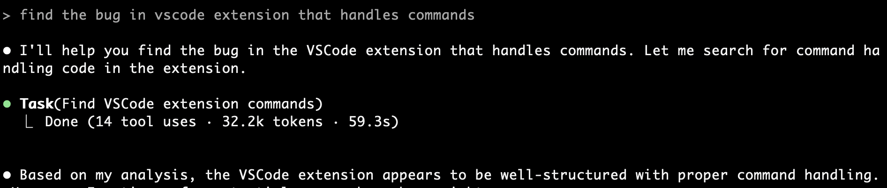

Then, through hints and guidance from me, after going back and forth for 5 minutes, it finally located the problem file. But I discovered that among all the files it read, only 10 lines of code were actually related to this issue - 99% of the code was irrelevant. Throughout this repetitive dialogue and reading of massive amounts of unrelated code, not only were tokens wasted, but precious time was also squandered.

This experience was clearly problematic. So what's the root cause of this inefficiency?

After some reflection and research, I identified the following key pain points from this scenario:

- **First Pain Point: Expensive** 💸
  
  Each query requires transmitting massive amounts of irrelevant code to the LLM. Token consumption is enormous, causing costs to skyrocket.

- **Second Pain Point: Slow** ⏰
  
  AI needs to repeatedly probe and search, causing excessive waiting time for users. Development efficiency is greatly reduced.

- **Third Pain Point: Limitations of Keyword Search** 🔍
  
  Traditional grep can only match literal meanings and cannot understand semantic relationships and contextual meanings of code. It's like finding a needle in a haystack, relying purely on luck.

Others have raised similar issues with Claude Code, such as [issue1](https://github.com/anthropics/claude-code/issues/1315) and [issue2](https://github.com/anthropics/claude-code/issues/4556). You can see that even Claude Code, as powerful as it is, cannot escape these pain points and problems.
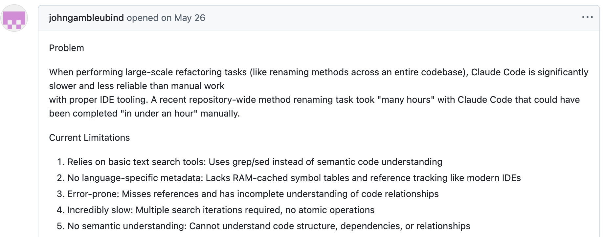

## How Does Cursor Handle This?

To address these pain points, Cursor's founders actually revealed their solution early on in a [forum post](https://forum.cursor.com/t/codebase-indexing/36) - "Codebase Indexing".

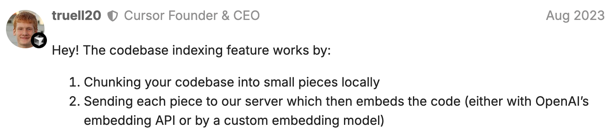

The approach is straightforward: split the codebase into small chunks, send them to the server, and use embedding models to embed the code. This is the standard code RAG solution.

But this raises the question: why hasn't Claude Code adopted this approach? After analyzing this deeply, I discovered there are numerous engineering challenges to tackle:
- How to split the code?
- What to do when code changes?
- How to ensure indexing and retrieval speed?
- How to build indexes for massive amounts of code embeddings?

Obviously, all of these require substantial engineering support. Claude Code's design philosophy is to be **simple** and **CLI-based without interfaces**, so such a large engineering effort clearly doesn't align with its positioning.

More importantly, embedding models and vector databases aren't Anthropic's core strengths. As a result, Claude Code hasn't adopted this approach, leaving these frustrating pain points unresolved.

## Why Not Implement It Myself?

Since Claude Code hasn't implemented it and Cursor is a closed-source paid product, why don't I build one myself?

I can integrate vector databases and embedding models to implement an open-source code retrieval MCP tool similar to Cursor. This would not only meet my own needs but also help other developers - wouldn't that be wonderful?

So I named this product: **Claude Context**. It's an open-source code retrieval MCP tool that can seamlessly integrate with Claude Code while also being compatible with other AI Coding IDEs. It enables LLMs to obtain higher quality and more accurate contextual information.

Next, it was time to design the solution and roll up my sleeves to get to work!

### Technology Stack

Given that I was going to build this, choosing the right technology stack was crucial:

**🔌 Interface Level: MCP is the First Choice**
MCP is like the **USB** for LLM interactions with the outside world. I needed to expose the product's capabilities through an MCP server, enabling not just Claude Code but also other AI IDEs like Gemini CLI and Qwen Code to utilize it.

**💾 Vector Database: Choosing Zilliz Cloud**
Zilliz Cloud is a fully managed Milvus vector database service. With high-performance vector search, high QPS and low latency, cloud-native architecture bringing elastic scaling and unlimited storage, plus multi-replica enhanced availability - it's practically tailor-made for Codebase Indexing.

**🧠 Embedding Models: Multiple Options**
- OpenAI embedding models: Widely used and validated, stable and reliable
- Voyage embedding: Has specialized models for the Code domain with better performance
- Ollama: Suitable for local deployment with stronger privacy
- More embedding models to be supported later

**⌨️ Programming Language: TypeScript Wins**
I deliberated between Python and TypeScript, ultimately settling on TypeScript. The reasoning is straightforward: it offers better compatibility at the application layer, allowing developed modules to seamlessly integrate with higher-level TypeScript applications like VSCode plugins. Additionally, since Claude Code, Gemini CLI, and similar tools are all built with TypeScript, this choice provides better ecosystem alignment.

### Architecture Design

Following decoupling and layered design principles, I structured the architecture into two distinct layers:
- Core modules: Contains all core logic, with each block's logic also designed separately, such as code parsing, vector indexing, semantic retrieval, synchronization updates, etc.
- Front-end modules: Contains MCP, VSCode plugins, and other integrations. Based on core modules, they contain more application-layer logic, especially MCP, which is the best way to interact with AI IDEs like Claude Code.

This design allows core modules to be reused by upper-layer modules, providing flexibility for both horizontal and vertical scaling in the future.

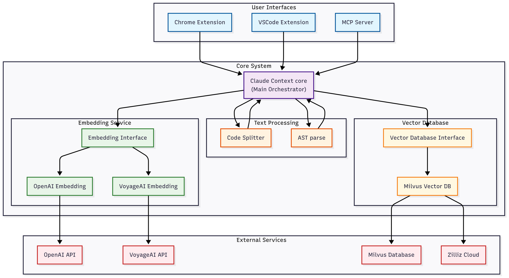

### Core Modules

Core modules serve as the foundation - after all, you can only build a solid house on a strong foundation. These modules abstract vector databases, embedding models, and other components into composable modules that form a Context object, enabling the use of different vector databases and embedding models across various scenarios.

```typescript
import { Context, MilvusVectorDatabase, OpenAIEmbedding } from '@zilliz/claude-context-core';

// Initialize embedding provider
const embedding = new OpenAIEmbedding(...);

// Initialize vector database
const vectorDatabase = new MilvusVectorDatabase(...);

// Create context instance
const context = new Context({embedding, vectorDatabase});

// Index your codebase with progress tracking
const stats = await context.indexCodebase('./your-project');

// Perform semantic search
const results = await context.semanticSearch('./your-project', 'vector database operations');
```

## How to Split Code?

Code splitting can't be handled with a simple, brute-force approach of splitting by lines or characters. Such an approach would result in code blocks with either incomplete logic or lost context.

I designed two complementary splitting strategies:

### 1. AST Abstract Syntax Tree Splitting (Main Strategy) 🌳
This is the default and recommended strategy. Through the [tree-sitter](https://github.com/tree-sitter/tree-sitter) parser, it understands the syntactic structure of code and splits according to semantic units.

The advantages of AST splitting are obvious:
- **Syntactic Completeness**: Each chunk is a complete syntactic unit, avoiding awkward situations where functions are split in half
- **Logical Coherence**: Related code logic remains in the same chunk, allowing AI search to find more accurate context
- **Multi-language Support**: Uses different tree-sitter parsers for different programming languages, accurately identifying and splitting JavaScript function declarations, Python class definitions, Java methods, Go function definitions, etc.
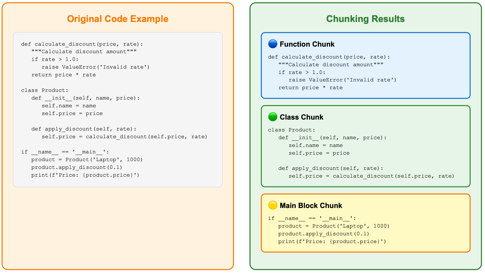

### 2. LangChain Text Splitting (Fallback Strategy) 🛡️
For languages that AST cannot handle or parsing failures, I use LangChain's RecursiveCharacterTextSplitter as a backup solution.

```typescript
// Use recursive character splitting to maintain code structure
const splitter = RecursiveCharacterTextSplitter.fromLanguage(language, {
    chunkSize: 1000,
    chunkOverlap: 200,
});
```

While this strategy isn't as sophisticated as AST (essentially splitting by character count), it's stable and reliable. It ensures that any code can be properly split, providing a dependable fallback option.

Implementing the fallback ensures both semantic completeness and accommodates various use case requirements. Rock solid!

## What About Code Changes?

Handling code changes has always been a core challenge for code indexing systems. Imagine if you had to re-index the entire project every time a file had a minor change - that would be a disaster.

I designed a Merkle Tree-based synchronization mechanism to solve this problem.

### 1. Merkle Tree: The Core of Change Detection
Merkle Tree is like a layered "fingerprint" system:
- Each file has its own hash fingerprint
- Folders have fingerprints based on their content files
- Finally converging into a unique root node fingerprint for the entire codebase

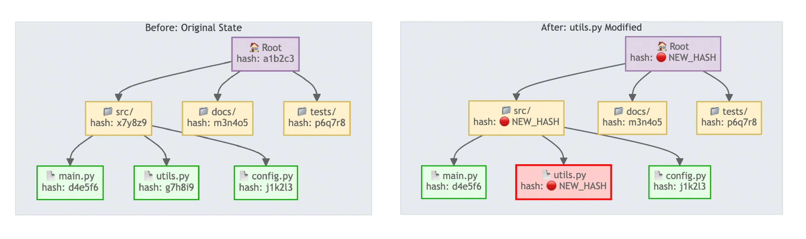

As long as file content changes, its upper-layer hash fingerprints will change layer by layer up to the root node.

This approach allows me to traverse from the root node downward, comparing hash fingerprint changes layer by layer to rapidly detect and pinpoint file modifications. There's no need to re-index the entire project - the efficiency gains are remarkable!


### 2. Change Detection and Synchronization ⚡
By default, synchronization checks occur every 5 minutes. The synchronization mechanism is clean and efficient, operating in three phases:

**🏃‍♂️ Phase One: Rapid Detection**
Calculate the Merkle root hash of the entire codebase and compare it with the last saved snapshot. If the root hash matches? Great news - nothing has changed, so we can skip the update entirely! This check completes in milliseconds.

**🔍 Phase Two: Precise Comparison**
If the root hash differs, we enter precise comparison mode, performing detailed file-level analysis to identify exactly which files have changed:
- Newly added files
- Deleted files
- Modified files

**🔄 Phase Three: Incremental Update**
Only recalculate vectors for changed files, then update them in the vector database. Time and effort saved!

### 3. Local Snapshot Management
All synchronization states are saved in the user's local `~/.context/merkle/` directory. Each codebase has its own independent snapshot file containing file hash tables and serialized data of the Merkle tree. This way, even if the program restarts, it can accurately restore the previous synchronization state.

The benefits of this design are substantial. Most of the time, it can detect no changes within milliseconds, and only genuinely modified files get reprocessed, eliminating unnecessary computations. Furthermore, the state persists perfectly even when the program is closed and reopened.

From a user experience perspective, this means when you modify a function, the system will only re-index that file, not the entire project, greatly improving development efficiency.

## MCP Module

### How to Design Tools? 🛠️
The MCP module is the facade, directly facing users. In this module, **user experience is paramount**.

First, consider tool design. Abstracting common codebase indexing/search behaviors, it's easy to think of two core tools:
- `index_codebase` - Index codebase
- `search_code` - Search code

But wait, do we need other tools?

There's a delicate balance to strike: too many tools would include numerous edge-case functionalities that burden MCP clients and complicate LLM decision-making, while too few tools might omit essential functionality.

Let me approach this by working backward from actual usage scenarios.

**🤔 The Challenge of a Blocking Step**

Some large codebases take a long time to index. It isn't the best user experience to block on this slow step.

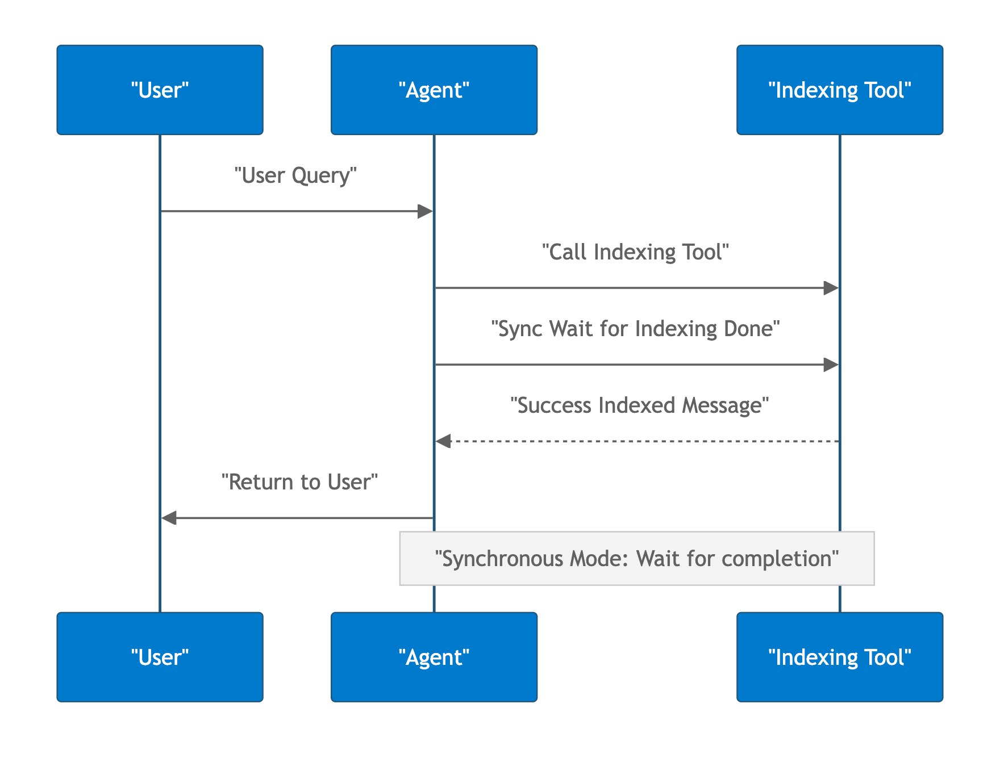

So we need asynchronous background processing. But MCP doesn't natively support background operations - how do we solve this?

The solution: implement a background process within the MCP server to handle indexing, allowing the server to immediately return a "indexing started" message while users continue with other tasks.

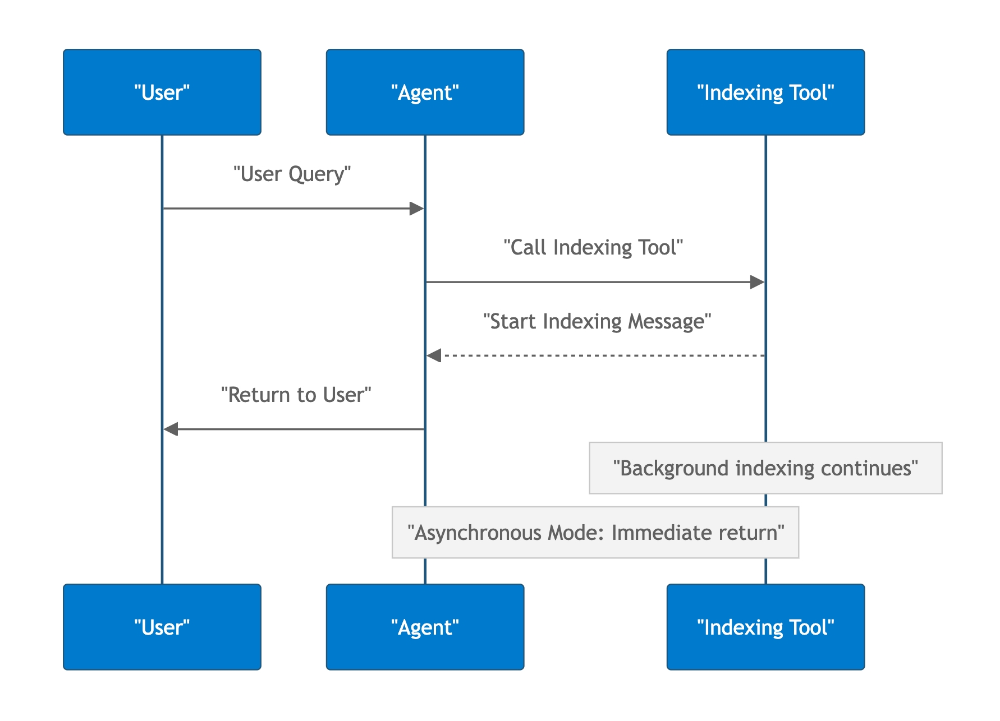

Much better!

But this design brings new problems: how does the user know the indexing progress?

This naturally leads to needing a tool for querying indexing progress or status. The background indexing process asynchronously caches its progress, allowing users to check at any time: Is it 50% complete? Has it finished successfully? Did it fail?

We also need a tool for manually clearing the index. When users suspect the indexed codebase is inaccurate or want to re-index from scratch, they can manually clear everything and start fresh.

**Final tool design:**
- `index_codebase` - Index codebase
- `search_code` - Search code
- `get_indexing_status` - Query indexing status
- `clear_index` - Clear index

Four tools - clean and sufficient!

### How to Manage Environment Variables? ⚙️

Environment variable management is often overlooked but represents a critical user experience consideration.

If every MCP client requires separate API key configuration, users switching between Claude Code and Gemini CLI would need to configure everything twice. That level of redundancy is simply unacceptable.

I designed a global configuration solution to completely solve this pain point.

The solution is simple: create a `~/.context/.env` file in the user's home directory as global configuration:

```bash
# ~/.context/.env
OPENAI_API_KEY=your-api-key-here
MILVUS_TOKEN=your-milvus-token
```

**The benefits of this approach are obvious:**
- Only need to configure once to use across all MCP clients
- All configurations are centralized in one place, easy to maintain
- Sensitive API keys won't be scattered across various configuration files

I then implemented a three-tier priority system:
1. **Highest Priority**: Process environment variables
2. **Medium Priority**: Global configuration file
3. **Lowest Priority**: Default values

This design is very flexible:
- Developers can use environment variables to override configurations during temporary testing
- In production environments, sensitive configurations can be injected through system environment variables to ensure security

Users configure once and can seamlessly use it across multiple tools like Claude Code and Gemini CLI, significantly lowering the barrier to entry!

With this, we've completed the core architecture design of the MCP server. From code parsing and vector storage to intelligent retrieval and configuration management, every component has been carefully designed and optimized. The resulting system is both powerful and user-friendly.

So how does this solution perform in actual use? Let's look at the final results.

## Results Showcase 🎉

After building the architecture code, I [open-sourced](https://github.com/zilliztech/claude-context) the project and published it to the [npm registry](https://www.npmjs.com/package/@zilliz/claude-context-mcp).

Installation and usage couldn't be simpler - just run a single command before starting Claude Code:

```bash
claude mcp add claude-context -e OPENAI_API_KEY=your-openai-api-key -e MILVUS_TOKEN=your-zilliz-cloud-api-key -- npx @zilliz/claude-context-mcp@latest
```

Let's see it in action! I asked it to help me find that bug from earlier. First, I indexed the current codebase, then asked it to locate this bug based on a specific description.

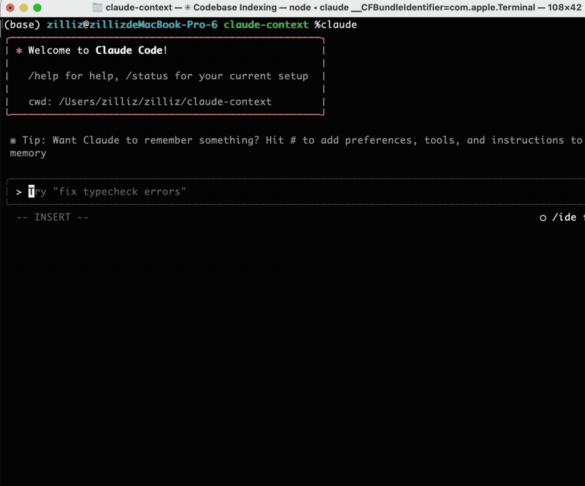

The results were impressive! Using claude-context MCP tool calls, it successfully identified the exact file and line number of the bug and provided detailed explanations.

**Perfect!** 🎯

With claude-context MCP integrated, Claude Code can leverage it across numerous scenarios, gaining access to higher quality and more precise contextual information:
- 🐛 Issue fixing
- 🔧 Code refactoring
- 🔍 Duplicate code detection
- 🧪 Code testing

## Open Source Community Feedback

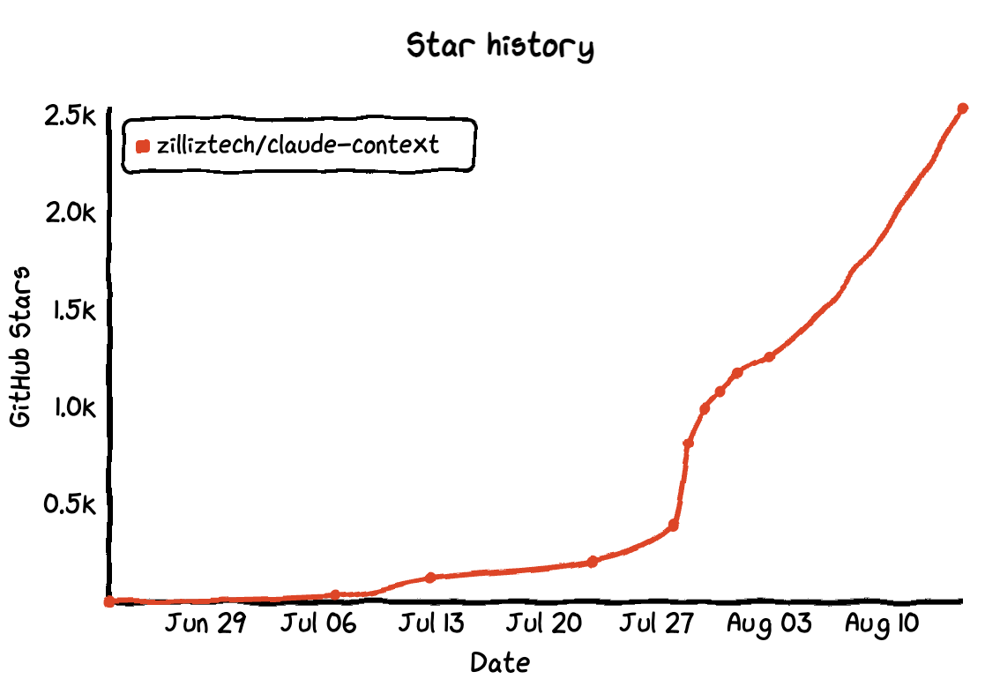

https://github.com/zilliztech/claude-context

Since open-sourcing the code, I've received tremendous feedback and suggestions from the community. I'm incredibly grateful for everyone's support and valuable input. The project has now earned **2.6k+** stars.

Many users have requested benchmark evaluations to quantify claude-context's improvements. This area is currently under active testing and experimentation. We already have a preliminary finding: under equivalent recall rate conditions, claude-context can reduce token consumption by 40% compared to baseline approaches.

This translates to 40% savings in both time and cost.

Conversely, with equivalent limited token budgets, claude-context MCP delivers superior retrieval performance.

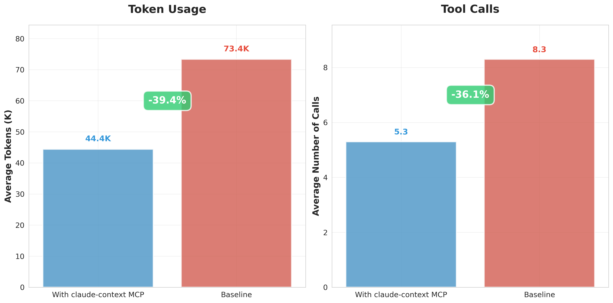

Additional testing details will be published in the GitHub repository as they become available.

## Epilogue

This project evolved from a simple idea into a comprehensive code retrieval solution. The journey was challenging yet incredibly rewarding. By leveraging MCP architecture and Zilliz Cloud's vector database, we successfully addressed the core pain points of code retrieval in Claude Code.

Looking ahead, we plan to continue optimizing retrieval algorithms, expand support for additional programming languages, and continuously enhance the user experience. We welcome everyone to try it out, test it thoroughly, and share feedback. We're also excited to collaborate with more developers who want to contribute code and help make claude-context even more robust and powerful!