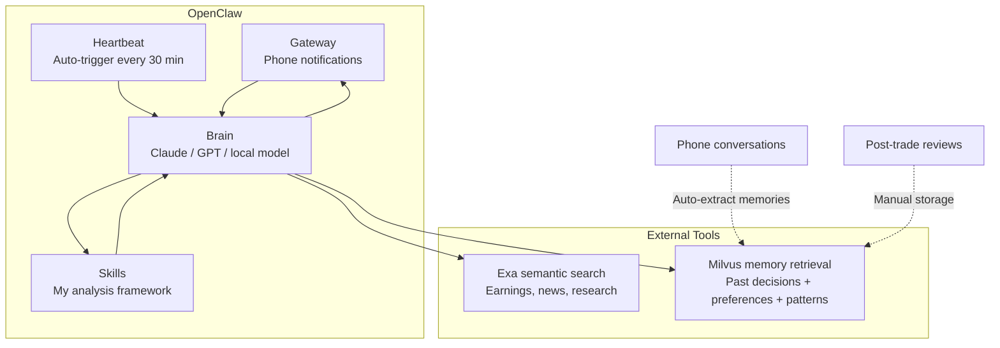

I have a full-time job and no time to watch the market all day. But I still want to stay informed, catch important events, and — most importantly — stop making the same mistakes twice. So I built an AI agent that does the watching for me.

The setup is straightforward: **OpenClaw** as the agent framework, **Exa** for real-time information retrieval, and **Milvus** as a personal memory store. The agent runs 24/7, monitors my watchlist, pulls in relevant news, cross-references my past decisions, and pushes a summary to my phone. I check in for a few minutes each morning and only act when something actually needs attention.

Here's an example of why this matters.

## The NVIDIA Earnings Test

On February 26, NVIDIA reported Q4 earnings — revenue up 65% year-over-year, beating expectations. The stock dropped 5.5% anyway.


I didn't find out until the next morning. But when I checked my phone, the agent had already sent me this the night before:

> NVDA earnings analysis: Revenue beat expectations, but the market is skeptical about the sustainability of AI capital expenditure. In similar past situations, the stock tended to dip short-term. You had a similar experience in September 2024 — you panic-sold and the stock recovered within three weeks. Recommendation: hold and observe.

It didn't just summarize the earnings report. It pulled up my own history and reminded me not to repeat a past mistake.

In September 2024, NVIDIA dropped 9% and I sold in a panic. Three weeks later, the price recovered fully — I'd lost 12% for nothing. This time, the agent caught the pattern and flagged it. I held. Right call.

Let me walk through how the system works.

---

## Information Gathering with Exa

The first problem to solve: where does the information come from?

I used to check news apps manually — slow, inconsistent coverage, and easy to miss things. Writing scrapers was another option, but financial sites update their anti-scraping measures constantly. I needed a stable, low-maintenance information source.

[Exa](https://exa.ai) is a search API designed for AI agents. Unlike traditional search engines, it uses semantic search — you describe what you're looking for in plain language instead of crafting keyword queries. The index refreshes every minute, and it filters out SEO spam automatically.

Basic usage:

```python
from exa_py import Exa

exa = Exa(api_key="your-api-key")

# Semantic search — describe what you want in plain language
result = exa.search(
    "Why did NVIDIA stock drop despite strong Q4 2026 earnings",
    type="neural",          # semantic search, not keyword
    num_results=10,
    start_published_date="2026-02-25",
    contents={
        "text": {"max_characters": 3000},       # get full article text
        "highlights": {"num_sentences": 3},     # key sentences
        "summary": {"query": "What caused the stock drop?"}  # AI summary
    }
)

for r in result.results:
    print(f"[{r.published_date}] {r.title}")
    print(f"  Summary: {r.summary}")
    print(f"  URL: {r.url}\n")
```

The `contents` parameter is the key part — it returns article text, key sentences, and AI-generated summaries in a single request. No need to open each link individually.

Where Exa really shines is its search modes.

**Category filtering** — when I only want earnings analysis from credible sources, not repackaged summaries:

```python
# Only financial reports from trusted sources
earnings = exa.search(
    "NVIDIA Q4 2026 earnings analysis",
    category="financial report",
    num_results=5,
    include_domains=["reuters.com", "bloomberg.com", "wsj.com"],
    contents={"highlights": True}
)
```

**Similar article discovery** — found a good analysis and want more like it:

```python
# "Show me more analysis like this one"
similar = exa.find_similar(
    url="https://fortune.com/2026/02/25/nvidia-nvda-earnings-q4-results",
    num_results=10,
    start_published_date="2026-02-20",
    contents={"text": {"max_characters": 2000}}
)
```

**Deep search** — for complex, multi-factor questions like geopolitical impact on supply chains:

```python
# Complex question — needs multi-source synthesis
deep_result = exa.search(
    "How will Middle East tensions affect global tech supply chain and semiconductor stocks",
    type="deep",
    num_results=8,
    contents={
        "summary": {
            "query": "Extract: 1) supply chain risk 2) stock impact 3) timeline"
        }
    }
)
```

**Real-time news** — for tracking breaking developments during market hours:

```python
# Breaking news only — today's date
breaking = exa.search(
    "US stock market breaking news today",
    category="news",
    num_results=20,
    start_published_date="2026-03-05",
    contents={"highlights": {"num_sentences": 2}}
)
```

I created about a dozen search templates covering the areas I follow: Fed policy, tech earnings, geopolitical risks, macro liquidity indicators. They run automatically each morning and push results to my phone. What used to be 30+ minutes of scrolling through news apps is now a 5-minute scan of a structured summary.

---

## Personal Memory with Milvus

Information retrieval solves "what's happening out there." But good decision-making also requires knowing yourself — what you got right, what you got wrong, and where your blind spots are.

These things are easy to forget. In October 2024, when Middle East tensions escalated and tech stocks sold off, I followed risk-aversion advice and sold too early, missing about 15% of the recovery. Two weeks later, the stock had fully bounced back. Lessons like this fade fast when you're busy.

So I stored them in Milvus.

### The Knowledge Base

[Milvus](https://milvus.io/) is a vector database — you convert text into embeddings (numerical vectors) and search by semantic similarity. "Middle East conflict causing tech selloff" and "geopolitical risk triggering semiconductor panic selling" share zero words in common, but vector search knows they're about the same thing.

I organized my knowledge base into three collections:

```python
from pymilvus import MilvusClient, DataType
from openai import OpenAI

milvus = MilvusClient("./my_investment_brain.db")
llm = OpenAI()

def embed(text: str) -> list[float]:
    return llm.embeddings.create(
        input=text, model="text-embedding-3-small"
    ).data[0].embedding

# Collection 1: past decisions and lessons
milvus.create_collection(
    "decisions",
    dimension=1536,
    auto_id=True
)

# Collection 2: my preferences and biases
milvus.create_collection(
    "preferences",
    dimension=1536,
    auto_id=True
)

# Collection 3: market patterns I've observed
milvus.create_collection(
    "patterns",
    dimension=1536,
    auto_id=True
)
```

### Storing Memories Automatically

Manually logging entries is tedious. Instead, I wrote a memory extractor that runs after each conversation with the agent. I chat naturally — mention something like "I think this AI rally looks like the 2000 dot-com bubble" — and the system automatically extracts and stores that as a preference signal:

```python
import json

def extract_and_store_memories(conversation: list[dict]) -> int:
    """
    After each chat session, extract personal insights
    and store them in Milvus automatically.
    """
    extraction_prompt = """
    Analyze this conversation and extract any personal investment insights.
    Look for:
    1. DECISIONS: specific buy/sell actions and reasoning
    2. PREFERENCES: risk tolerance, sector biases, holding patterns
    3. PATTERNS: market observations, correlations the user noticed
    4. LESSONS: things the user learned or mistakes they reflected on

    Return a JSON array. Each item has:
    - "type": one of "decision", "preference", "pattern", "lesson"
    - "content": the insight in 2-3 sentences
    - "confidence": how explicitly the user stated this (high/medium/low)

    Only extract what the user clearly expressed. Do not infer or guess.
    If nothing relevant, return an empty array.
    """

    response = llm.chat.completions.create(
        model="gpt-4o",
        messages=[
            {"role": "system", "content": extraction_prompt},
            *conversation
        ],
        response_format={"type": "json_object"}
    )

    memories = json.loads(response.choices[0].message.content)
    stored = 0

    for mem in memories.get("items", []):
        if mem["confidence"] == "low":
            continue    # skip uncertain inferences

        collection = {
            "decision": "decisions",
            "lesson": "decisions",
            "preference": "preferences",
            "pattern": "patterns"
        }.get(mem["type"], "decisions")

        # Check for duplicates — don't store the same insight twice
        existing = milvus.search(
            collection,
            data=[embed(mem["content"])],
            limit=1,
            output_fields=["text"]
        )

        if existing[0] and existing[0][0]["distance"] > 0.92:
            continue    # too similar to existing memory, skip

        milvus.insert(collection, [{
            "vector": embed(mem["content"]),
            "text": mem["content"],
            "type": mem["type"],
            "source": "chat_extraction",
            "date": "2026-03-05"
        }])
        stored += 1

    return stored
```

The key details: it only stores things I explicitly said (low-confidence inferences are skipped), and it deduplicates against existing entries using a similarity threshold of 0.92. Over time, the system builds a progressively richer picture of my investment behavior without me keeping notes.

### Retrieval: Adding Personal Context to Analysis

When the agent analyzes a current market situation, it first checks the knowledge base:

```python
def recall_my_experience(situation: str) -> dict:
    """
    Given a current market situation, retrieve my relevant
    past experiences, preferences, and observed patterns.
    """
    query_vec = embed(situation)

    past_decisions = milvus.search(
        "decisions", data=[query_vec], limit=3,
        output_fields=["text", "date", "tag"]
    )
    my_preferences = milvus.search(
        "preferences", data=[query_vec], limit=2,
        output_fields=["text", "type"]
    )
    my_patterns = milvus.search(
        "patterns", data=[query_vec], limit=2,
        output_fields=["text"]
    )

    return {
        "past_decisions": [h["entity"] for h in past_decisions[0]],
        "preferences": [h["entity"] for h in my_preferences[0]],
        "patterns": [h["entity"] for h in my_patterns[0]]
    }

# When the agent analyzes the current tech selloff:
context = recall_my_experience(
    "tech stocks dropping 3-4% due to Middle East tensions, March 2026"
)

# context now contains:
# - My 2024-10 lesson about not panic-selling during ME crisis
# - My preference: "I tend to overweight geopolitical risk"
# - My pattern: "tech selloffs from geopolitics recover in 1-3 weeks"
```

This is why the NVIDIA alert at the beginning of this post referenced my trading history from a year ago. The agent found a relevant lesson in my own records and surfaced it at exactly the right moment.

---

## Decision Framework: Encoding My Analysis Logic as a Skill

With information and memory in place, there's one more piece: analysis logic.

If you just dump news and memories into an LLM and say "analyze this," you get a generic, hedge-everything response that's useless for actual decisions. I needed the agent to follow **my** criteria — which indicators matter to me, what I consider a red flag, when to be cautious versus aggressive.

OpenClaw's Skills mechanism handles this. You place a Markdown file in the agent's `skills/` directory that defines a structured analysis framework. The agent invokes it automatically when relevant:

```yaml
---
name: post-earnings-eval
description: >
  Evaluate whether to buy, hold, or sell after an earnings report.
  Trigger when discussing any stock's post-earnings price action,
  or when a watchlist stock reports earnings.
---

## Post-Earnings Evaluation Framework

When analyzing a stock after earnings release:

### Step 1: Get the facts
Use Exa to search for:
- Actual vs expected: revenue, EPS, forward guidance
- Analyst reactions from top-tier sources
- Options market implied move vs actual move

### Step 2: Check my history
Use Milvus recall to find:
- Have I traded this stock after earnings before?
- What did I get right or wrong last time?
- Do I have a known bias about this sector?

### Step 3: Apply my rules
- If revenue beat > 5% AND guidance raised → lean BUY
- If stock drops > 5% on a beat → likely sentiment/macro driven
  - Check: is the drop about THIS company or the whole market?
  - Check my history: did I overreact to similar drops before?
- If P/E > 2x sector average after beat → caution, priced for perfection

### Step 4: Output format
Signal: BUY / HOLD / SELL / WAIT
Confidence: High / Medium / Low
Reasoning: 3 bullets max
Past mistake reminder: what I got wrong in similar situations

IMPORTANT: Always surface my past mistakes. I have a tendency to
let fear override data. If my Milvus history shows I regretted
selling after a dip, say so explicitly.
```

The last line is the most important part — a built-in self-correction mechanism: "I tend to let fear override data. If my history shows I regretted panic-selling, tell me."

---

## Running It Autonomously

All of the above still requires me to trigger things manually. For someone with a full-time job, what I actually want is simple: **relevant information shows up on my phone without me doing anything.**

OpenClaw has a Heartbeat mechanism for this. The Gateway process sends a pulse to the agent at a configurable interval (default 30 minutes), and the agent decides what to do based on a `HEARTBEAT.md` file:

```markdown
# HEARTBEAT.md — runs every 30 minutes automatically

## Morning brief (6:30-7:30 AM only)
- Use Exa to search overnight US market news, Asian markets, oil prices
- Search Milvus for my current positions and relevant past experiences
- Generate a personalized morning brief (under 500 words)
- Flag anything related to my past mistakes or current holdings
- End with 1-3 action items
- Send the brief to my phone

## Price alerts (during US market hours 9:30 AM - 4:00 PM ET)
- Check price changes for: NVDA, TSM, MSFT, AAPL, GOOGL
- If any stock moved more than 3% since last check:
  - Search Milvus for: why I hold this stock, my exit criteria
  - Generate alert with context and recommendation
  - Send alert to my phone

## End of day summary (after 4:30 PM ET on weekdays)
- Summarize today's market action for my watchlist
- Compare actual moves with my morning expectations
- Note any new patterns worth remembering
```

No Python scripts, no cron jobs, no server deployment. The Gateway process runs in the background, reads this file, and executes based on time and conditions.

My daily routine now looks like this: wake up around 7:50 AM, check my phone — the morning brief is already there. A 5-minute scan tells me what happened overnight and whether it affects my positions. During work hours, I only get notified if something moves more than 3%. On weekends, I spend 30 minutes reviewing the weekly summary.

---

## How It All Fits Together



The total cost: Exa API roughly $10/month, LLM API calls roughly $10/month, OpenClaw and Milvus both run locally for free. About $20/month total.

---

## What Actually Changed

Let me come back to that NVIDIA alert.

Without this system, the scenario would have gone like this: I'm busy at work, check the news the next morning, see NVIDIA dropped, feel a knot in my stomach, vaguely remember something similar happened before but can't recall the details, sell to be safe, then watch it recover a month later.

This exact pattern has played out more than once in my trading history.

Now it's different. The agent had the analysis ready before I woke up. It pulled my own post-trade review from the last time this happened and reminded me that I regretted selling. When I saw the message that morning, I was rested, fully informed, and made a calm decision: do nothing. That turned out to be right.

The system doesn't make decisions for me. It makes sure I have complete information — including my own past experiences — when I need to make one. For someone who can't watch the market all day, that's enough.

## Getting Started

If you want to build something similar, here's the minimal path:

1. **Install OpenClaw** — set up the gateway and connect your phone.
2. **Set up Exa** — create a few search templates for the topics you follow. Free tier is available to start.
3. **Set up Milvus** — `MilvusClient("./local.db")` runs entirely locally, no server needed.
4. **Write a Heartbeat** — start with just a morning brief. Get one useful summary delivered to your phone each day.
5. **Iterate** — add skills, expand memory, refine search templates over time.

Start with the smallest useful loop and expand from there. The tools are all open-source or have free tiers, so the barrier is low.

What I find most interesting isn't the investment use case specifically — it's the pattern. Swap the skills and data sources, and this same architecture works for monitoring research papers, competitor products, supply chains, or anything else that benefits from continuous, context-aware information retrieval. A year ago, building this would have taken thousands of lines of glue code. Today it's mostly Markdown configuration files and a few Python functions.

---

*Disclaimer: This post describes a personal technical project. All market analysis examples are illustrative and do not constitute investment advice. Investing involves risk; make your own informed decisions.*
